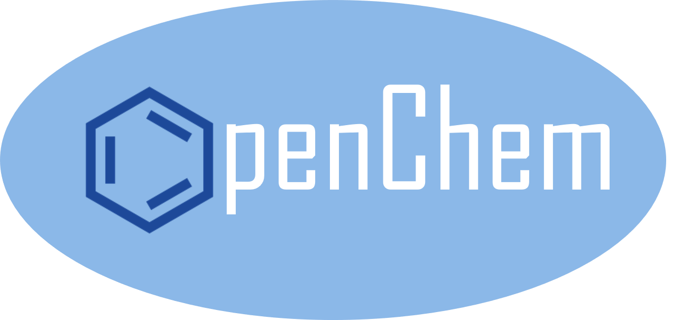

<p align="center">
  
 </p>

# OpenChem

OpenChem is a deep learning toolkit for Computational Chemistry with [PyTorch](https://pytorch.org) backend. The goal of OpenChem is to make Deep Learning models an easy-to-use tool for Computational Chemistry and Drug Design Researchers. 

# Main features

* Modular design with unified API, modules can be easily combined with each other.
* OpenChem is easy-to-use: new models are built with only configuration file.
* Fast training with multi-gpu support.
* Utilities for data preprocessing.
* Tensorboard support.

# Documentation

Check out OpenChem documentation [here](https://mariewelt.github.io/OpenChem/).

# Supported functionality
## Tasks:
* Classification (binary or multi-class)
* Regression
* Multi-task (such as N binary classification tasks)
* Generative models

## Data types
* Sequences of characters such as SMILES strings or amino-acid sequences
* Molecular graphs. OpenChem takes care of converting SMILES strings into molecular graphs

## Modules:
* Token embeddings
* Recurrent neural network encoders
* Graph convolution neural network encoders
* Multi-layer perceptrons

We are working on populating OpenChem with more models and other building blocks.

# Installation

## Requirements
In order to get started you need:
* Modern NVIDIA GPU, [compute capability 3.5](https://developer.nvidia.com/cuda-gpus) or newer.
* Python 3.5 or newer (we recommend [Anaconda](https://www.anaconda.com/) distribution)
* [CUDA 9.0 or newer](https://developer.nvidia.com/cuda-downloads)

## General installation

If you installed your Python with Anaconda you can run the following commands to get started:
```bash
git clone https://github.com/Mariewelt/OpenChem.git
cd OpenChem
conda create --name OpenChem python=3.7
conda activate OpenChem
conda install --yes --file requirements.txt
conda install -c rdkit rdkit nox cairo
conda install pytorch torchvision -c pytorch
pip install -e .
```
If your CUDA version is other than 10.0, check [Pytorch](https://pytorch.org) website for different installation instructions. 

## Installation with Docker
Alternative way of installation is with Docker. We provide a Dockerfile, so you can run your models in a container that already has all the necessary packages installed. You will also need nvidia-docker in order to run models on GPU.

# Acknowledgements

OpenChem is sponsored by [the University of North Carolina at Chapel Hill](https://www.unc.edu/) and [NVIDIA Corp.](https://www.nvidia.com/en-us/) 
<p align="center">
  
  
  <br>
</p>
